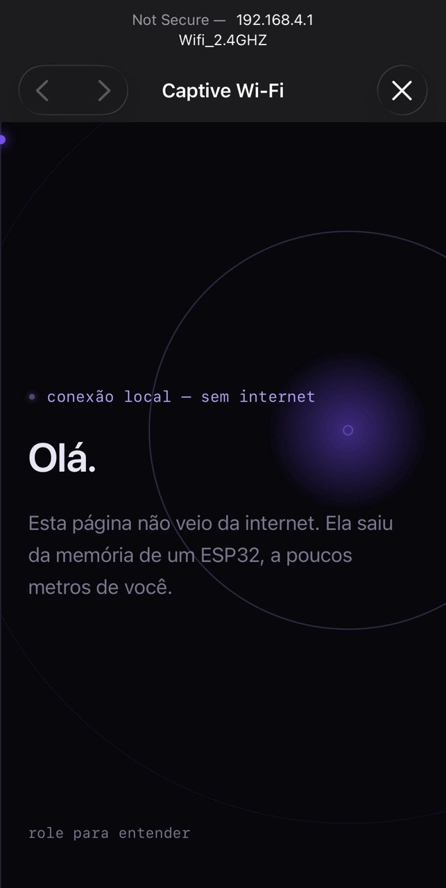

# 📡 CaptivePortal

Um captive portal "limpo" feito com ESP32: cria uma rede Wi-Fi aberta, intercepta as consultas DNS e serve uma página local explicando, na prática, como esse mecanismo funciona.

**Sem login falso. Sem captura de credenciais.** O foco é entender a mecânica de rede por trás do fenômeno, não replicar golpes.

## Como fica

Quando alguém conecta na rede, o celular detecta o captive portal e abre essa página sozinho.

## Como funciona

O projeto roda em três peças simples, ao mesmo tempo:

1. **Ponto de acesso** — o ESP32 cria a própria rede Wi-Fi (`WiFi.softAP`), em vez de se conectar a uma
2. **Sequestro de DNS local** — qualquer domínio que o dispositivo conectado tenta resolver é respondido com o IP do próprio ESP32 (`DNSServer` com wildcard `"*"`)
3. **Servidor web embarcado** — a página é servida direto da memória flash do chip (`WebServer` + `PROGMEM`)

## O que a página mostra

- Uma explicação, em linguagem simples, do que acabou de acontecer com a conexão do visitante
- Os três passos técnicos por trás do captive portal
- Uma seção de conscientização sobre redes Wi-Fi abertas, incluindo o golpe **evil twin** (redes falsas com tela de login que roubam credenciais de redes sociais)

## Hardware necessário

| Componente | Observação |
|---|---|
| ESP32 (DevKit ou similar) | Qualquer variante com Wi-Fi já serve |
| Cabo USB | Pra alimentação e upload do código |

Não precisa de OLED, botão ou qualquer componente externo — é só o chip.

## Bibliotecas usadas

Vêm inclusas no pacote de placas ESP32 da Arduino IDE, não precisa instalar nada separado:
- `WiFi.h`
- `DNSServer.h`
- `WebServer.h`

## Como usar

1. Abra `CaptivePortal.ino` na Arduino IDE
2. Selecione a placa ESP32 correta em **Ferramentas > Placa**
3. Ajuste o nome da rede na constante `ssid`, se quiser
4. Faça o upload
5. Abra o Monitor Serial (115200 baud) pra confirmar o IP do Access Point
6. Conecte um celular na rede criada — a página deve abrir sozinha

## Aviso

Este projeto é só pra fins educacionais, sobre redes e segurança. A rede é aberta, não coleta nenhuma informação de quem conecta, e a página não pede login nem dado nenhum.

---

Projeto pessoal de estudo em redes e cibersegurança.
